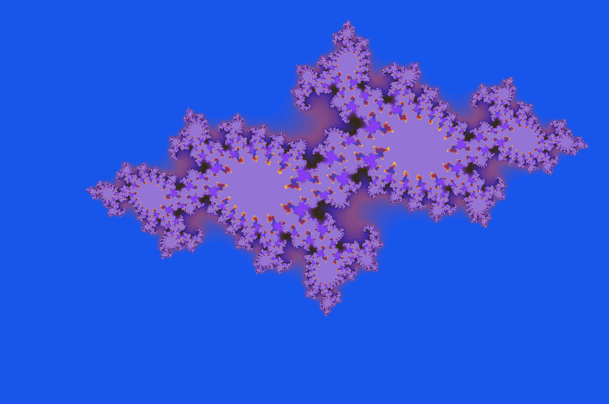

# SFML-fractal
 Small fractal visualizer in SFML

## Controls
- Arrow keys to move the camera
- Tab and space to zoom in and out
- X to enable/disable the influence of the number of steps on the alpha channel
- R to randomize the colors of the fractal
- T to change the current farctal

